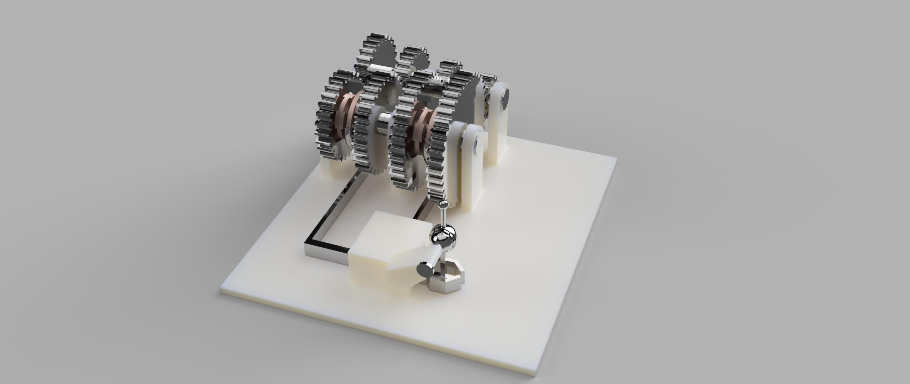
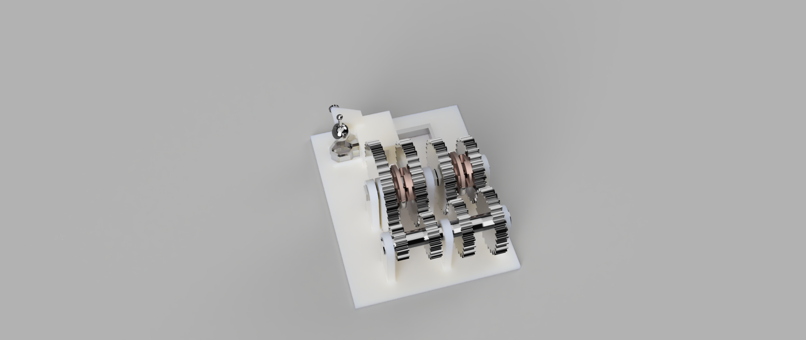

# ⚙️ 4-Speed Manual Gearbox Project
### *Inspired by the Getrag MMT6 (Ford Mondeo MK4 2.0 TDCi)*

---

## 📋 Project Overview
This project involves the design and functional simulation of a 4-speed manual transmission in Autodesk Fusion 360. The gear ratios are modeled after the first four speeds of the **Getrag MMT6 6-speed manual gearbox** found in the Ford Mondeo MK4 with a 2.0 TDCi engine.

The transmission uses a **constant mesh architecture** where all gear pairs remain engaged, with power transfer controlled via a sliding dog clutch mechanism. This project demonstrates the principles of mechanical power transmission, gear design, and motion simulation through 3D modeling.

---

## 🎬 Functionality Demonstration
A comprehensive video walkthrough showcasing the 3D model assembly and motion links simulation is available here:

**[📹 Watch Project Demonstration](https://www.youtube.com/watch?v=kbr8daeaz00)**

The video covers:
- Overall transmission assembly overview
- Motion links activation and simulation for all four gears
- Gear engagement and rotation mechanics
- Assembly and disassembly sequence

---

## 🔧 Technical Specifications
| Component | Specification |
| :--- | :--- |
| **Gear Type** | Spur Gears (for high torque & low noise) |
| **Reference Gearbox** | Getrag MMT6 (6-Speed Manual) |
| **Output Shaft Diameter** | 15mm Circular |
| **Shifting Mechanism** | Sliding Dog Clutch |
| **Design Tool** | Autodesk Fusion 360 |
| **Architecture** | Constant Mesh |

---

## 📊 Gear Ratio Data (MMT6 2.0 TDCi)
The model utilizes the factory ratios of the Ford Mondeo MK4 to maintain authenticity and technical accuracy.

| Gear | Ratio | Tooth Count (Approximated) | Speed Reduction |
| :--- | :--- | :--- | :--- |
| **1st Gear** | **3.230 : 1** | 13T Driver / 42T Driven | Maximum torque, lowest speed |
| **2nd Gear** | **2.055 : 1** | 18T Driver / 37T Driven | Medium torque, medium speed |
| **3rd Gear** | **1.391 : 1** | 23T Driver / 32T Driven | Lower torque, higher speed |
| **4th Gear** | **1.037 : 1** | 27T Driver / 28T Driven | Minimal reduction, overdrive |

---

## 🏗️ Design Methodology
The transmission design employs a **constant mesh architecture** where all gear pairs are permanently engaged. Power transfer is controlled exclusively through the dog clutch, which locks the desired gear to the mainshaft.

### Modeling Process in Fusion 360
- **Revolute Joints:** Applied to input and countershaft for rotational movement
- **Motion Links:** Simulate the gear ratios for each speed:
  - 1st Gear: 1/3.231 reduction
  - 2nd Gear: 1/2.055 reduction
  - 3rd Gear: 1/1.391 reduction
  - 4th Gear: 1/1.037 reduction (direct drive/overdrive)

---

## 📦 Assembly Breakdown

### Main Components

1. **Countershaft (Layshaft)**
   - Intermediary component between input and output
   - Carries all four driving gears
   - Establishes the mechanical link for all four speeds

2. **Mainshaft (Output Shaft)**
   - Carries all four driven gears
   - Diameter: 15mm
   - Power output to the vehicle drivetrain

3. **Dog Clutch Assembly**
   - Selectively locks gears to the mainshaft
   - Enables seamless gear transitions
   - Controlled via shifting mechanism

4. **Support Structures**
   - Provide shaft alignment and load support
   - Enable smooth rotation with minimal friction

---

## 📁 Project Files

### Included in Repository
- **F3D Files** - Complete Autodesk Fusion 360 project file with all components, assemblies, and motion links (2 versions with different mainshafts)
- **STL Files** - Complete files ready to be used in a slicer program (2 versions with different mainshafts)
- **G-code Files** - CNC machine instructions for all printable components (sliced for FDM 3D printing)
  - All .gcode files are optimized for 0.4mm nozzle, 0.2mm layer height
  - Estimated print times and material requirements included

---

## 🎞️ Renders

Both gearbox variants (which differ in the layshaft) were rendered using Fusion 360’s built‑in rendering tools. Realistic materials were applied to enhance visual authenticity.

---

## 🛠️ Components & Parts List

| Part Name | Quantity | Material | Purpose | Notes |
| :--- | :--- | :--- | :--- | :--- |
| Layshaft | 1 | Metal | Intermediate torque transfer | Carries 4 driving gears |
| Mainshaft | 1 | Metal | Power output | output to drivetrain |
| 1st Gear Pair | 1 set | Metal | 3.230:1 reduction | 13T & 42T |
| 2nd Gear Pair | 1 set | Metal | 2.055:1 reduction | 18T & 37T |
| 3rd Gear Pair | 1 set | Metal | 1.391:1 reduction | 23T & 32T |
| 4th Gear Pair | 1 set | Metal | 1.037:1 direct drive | 27T & 28T |
| Clutch Mounts | 4 | Metal | Gear engagement | Connects the clutch with a specific gear |
| Clutch | 2 | Printed/Metal | Selective gear engagement | Locks gear to mainshaft |
| Gear Selector+Guiders | 1 | Metal | Mechanical actuation | Moves dog clutch |
| Main Block | 1 | Printed | Foundation of the gearbox | Houses the gears, the clutches and the gear selector |

---

## 📚 Resources Used

### Primary References
- **Ford Mondeo MK4 Technical Specifications** - Getrag MMT6 gearbox data sheets
- **Autodesk Fusion 360 Documentation** - Motion links and joint configuration
- **Mechanical Engineering References**:
  - Gear Theory & Design principles
  - Spur gear tooth profile generation (involute curves)
  - Transmission architecture and constant-mesh systems

### Software & Tools
- **Autodesk Fusion 360** - CAD modeling and motion simulation
- **Autodesk Slicer for Fusion 360** - STL file generation
- **Prusa Slicer** - G-code generation for 3D printing
  
---

## 📖 Design Notes & Considerations

### Why Spur Gears?
Spur gears were chosen for this design due to:
- **High torque capacity** - Essential for transmission application
- **Lower noise profile** compared to helical gears
- **Simpler manufacturing** - Easier to model and 3D print accurately
- **Cost-effective** - No additional components needed

### Constant Mesh Architecture Advantages
- Simple and reliable design
- Smooth power delivery
- Easy to model and simulate
- Used in real-world transmissions like the Getrag MMT6

### Manufacturing Considerations
- All components are designed for 3D printing with support structures
- Layer height: 0.2mm for gear tooth accuracy
- Infill: 10%
- Print orientation optimized for minimal support material

